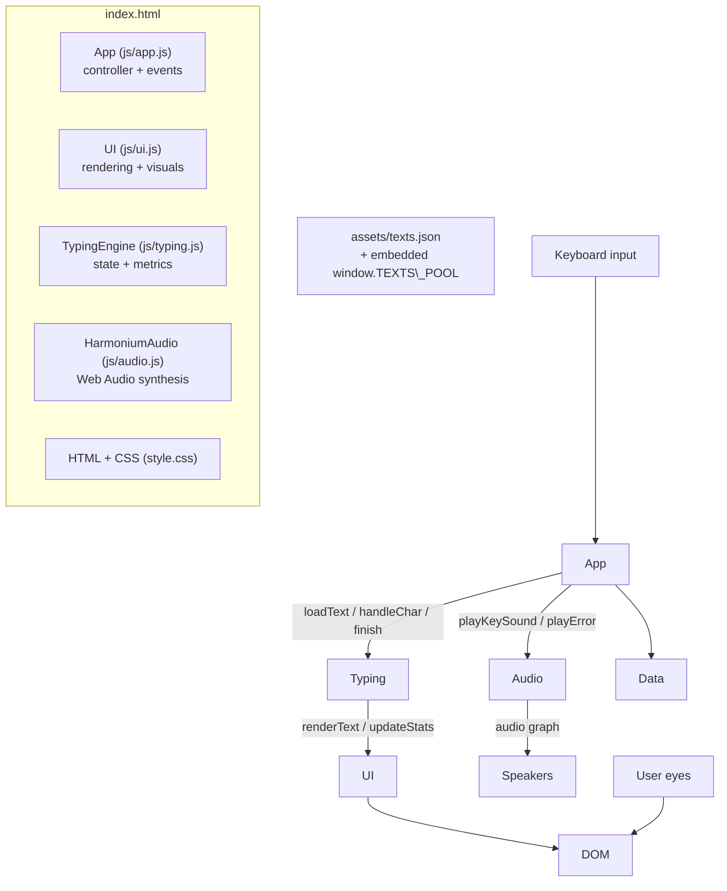
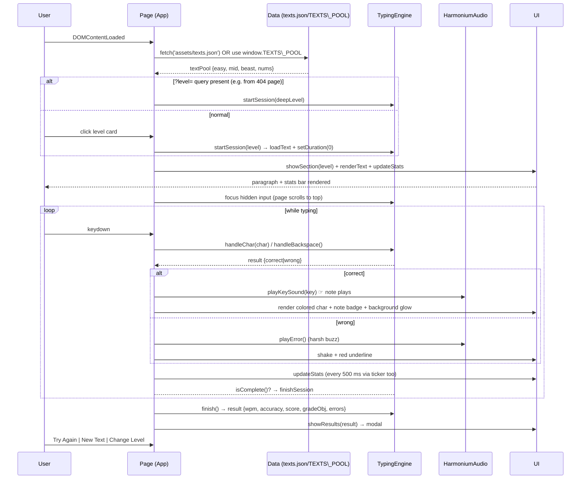
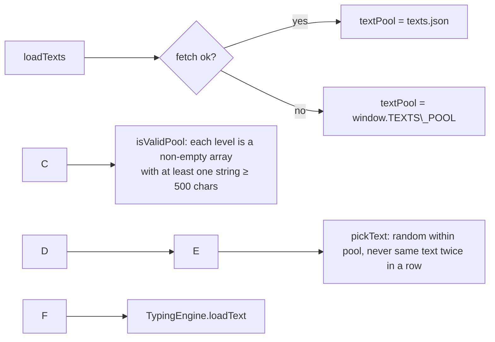
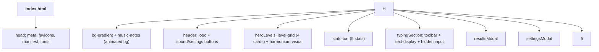
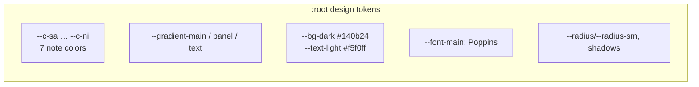
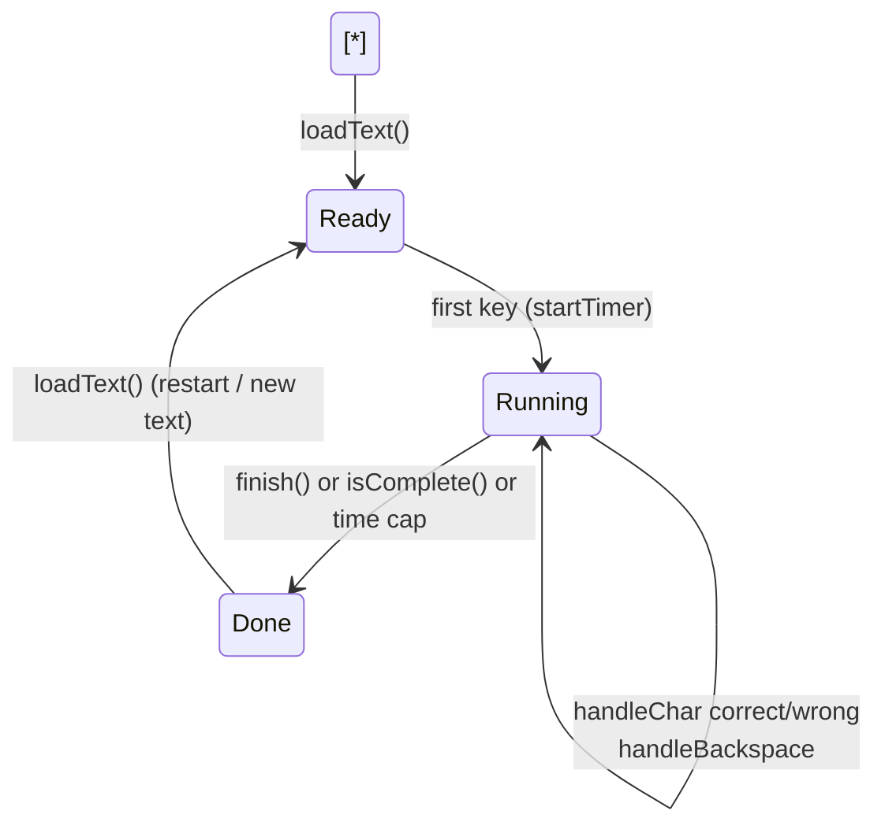
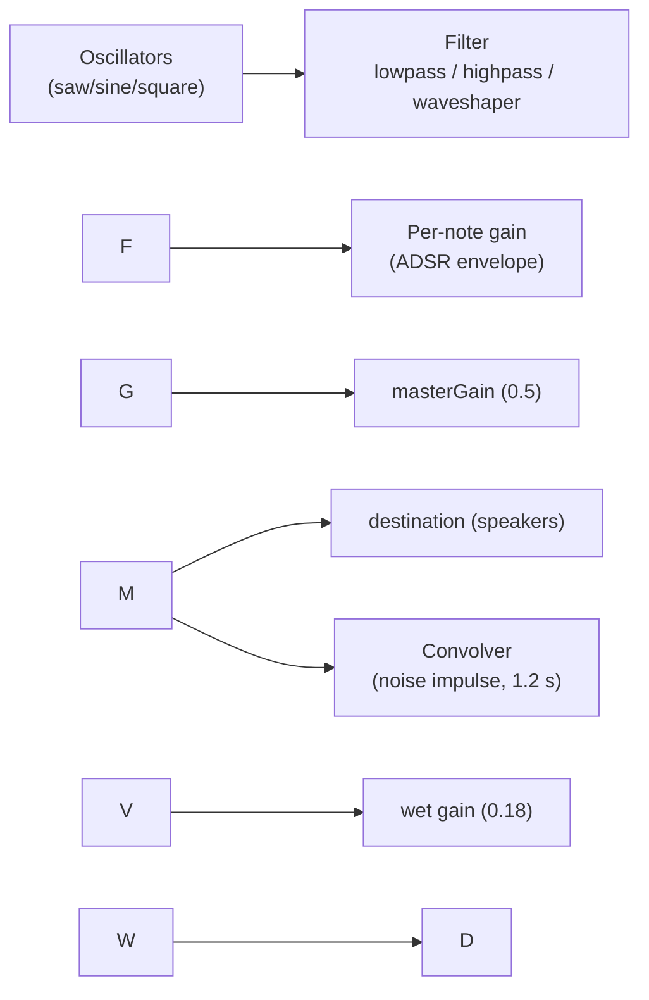
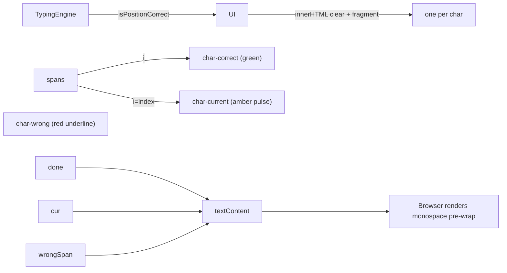
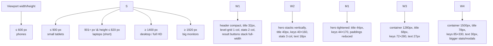

# Harmonium Typist — Complete Project Documentation

> A musical typing-practice website. Every key you press plays a harmonium note
> (Indian sargam or Western scale). No timer, four difficulty levels, paragraph-long
> practice texts, live stats, and a full static-site deployment setup.

**Project root:** `D:\\Laxminarayan\\Project\\KeyboardHarmonium`

\---

## Table of Contents

1. [Project Overview](#1-project-overview)
2. [Technologies Used](#2-technologies-used)
3. [Quick Start](#3-quick-start)
4. [Project Structure](#4-project-structure)
5. [High-Level Architecture](#5-high-level-architecture)
6. [Application Lifecycle](#6-application-lifecycle)
7. [Data Layer — Practice Texts](#7-data-layer--practice-texts)
8. [Code Walkthrough — File by File](#8-code-walkthrough--file-by-file)

   * [8.1 `index.html`](#81-indexhtml)
   * [8.2 `css/style.css`](#82-cssstylecss)
   * [8.3 `js/typing.js` — Typing Engine](#83-jstypingjs--typing-engine)
   * [8.4 `js/audio.js` — Sound Engine](#84-jsaudiojs--sound-engine)
   * [8.5 `js/ui.js` — Rendering \& Visuals](#85-jsuijs--rendering--visuals)
   * [8.6 `js/app.js` — Application Controller](#86-jsappjs--application-controller)
   * [8.7 `assets/\*` — Favicons, Texts, Brand Images](#87-assets--favicons-texts-brand-images)
   * [8.8 Static-Site Files](#88-static-site-files)
9. [Scoring \& Grades](#9-scoring--grades)
10. [Responsive Behaviour](#10-responsive-behaviour)
11. [Diagrams](#11-diagrams)
12. [Known Notes \& Limitations](#12-known-notes--limitations)
13. [Possible Improvements](#13-possible-improvements)

\---

## 1\. Project Overview

**Harmonium Typist** is a browser-based typing tutor with a musical soul. Instead of a
boring click sound, every correct keystroke synthesizes a **harmonium note** in real time
using the **Web Audio API**. The user picks a difficulty level, types a long, hand-written
paragraph at their own pace, and gets scored on speed (WPM), accuracy, errors, and a letter
grade. The page also glows, shakes, and rains musical-note particles to make practice feel
alive.

### Core features

|Feature|Description|
|-|-|
|**Four difficulty levels**|`easy`, `mid`, `beast`, `nums` — each with its own character-set rules and hint.|
|**Real harmonium sound**|Sawtooth reed tone through a mellow lowpass, plus reverb — no audio samples needed.|
|**Two note styles**|Indian sargam scale (Sa = C♯4) or Western scale (Sa = C4, i.e., C–D–E–F–G–A–B).|
|**Three keyboard octaves**|Top row (Q–P) = lower octave, middle row (A–L) = home octave, bottom row (Z–M) = upper octave.|
|**Untimed practice**|No countdown — finish the paragraph whenever you like.|
|**Live stats**|WPM, accuracy %, elapsed seconds, error count, progress %.|
|**Long content**|29 hand-written paragraphs, each 1–5 pages long (≈2,000–11,300 characters).|
|**Works without a server**|The full text pool is embedded inline, so opening `index.html` via `file://` still works.|
|**Error feedback**|Harsh buzzing "wrong" sound, screen shake, red underline, and a colored background flash.|
|**Static-site ready**|SEO meta, Open Graph, PWA manifest, favicon set, `robots.txt`, `sitemap.xml`, `404.html`.|

\---

## 2\. Technologies Used

|Technology|Purpose|
|-|-|
|**HTML5**|Page structure (`index.html`, `404.html`)|
|**CSS3**|Styling, glassmorphism, gradients, animations, responsive breakpoints|
|**JavaScript (ES6)**|All logic via four **IIFE modules** (no framework, no build step)|
|**Web Audio API**|Real-time audio synthesis (`AudioContext`, oscillators, filters, convolver, waveshaper)|
|**JSON**|Practice text pool (`assets/texts.json` + embedded copy)|
|**SVG**|Logo/favicon + a generated social-share card|
|**PWA Manifest**|Installability metadata|

There is **no Node.js build tooling** required to run the site — it is plain static files.
(Node was used only as a helper during development.)

\---

## 3\. Quick Start

```bash
# Option A — Python static server (recommended for testing fetch())
cd D:\\Laxminarayan\\Project\\KeyboardHarmonium
python -m http.server 8000
# -> open http://localhost:8000

# Option B — VS Code "Live Server" extension
# Right-click index.html -> "Open with Live Server"

# Option C — no server at all
# Just double-click index.html (opens with file:// )
# The embedded text pool (assets/texts.inline.js) makes this still work.
```

\---

## 4\. Project Structure

```
KeyboardHarmonium/
│
├── index.html                 # Single-page application entry point
├── 404.html                   # Branded 404 page for static hosting
├── manifest.webmanifest       # PWA manifest (name, theme, icons)
├── robots.txt                 # Search-engine crawl rules
├── sitemap.xml                # SEO sitemap
├── .nojekyll                  # Tells GitHub Pages not to run Jekyll
│
├── css/
│   └── style.css              # All styling incl. responsive breakpoints
│
├── js/
│   ├── audio.js               # HarmoniumAudio — Web Audio sound engine
│   ├── typing.js              # TypingEngine — metrics \& input state machine
│   ├── ui.js                  # UI — DOM rendering, particles, feedback
│   └── app.js                 # App — controller, wiring, events, init
│
└── assets/
    ├── texts.json             # Master practice-text pool (29 texts)
    ├── texts.inline.js        # window.TEXTS\_POOL — embedded copy for file://
    ├── favicon.svg            # Brand icon (also used as navbar logo)
    ├── favicon.ico            # 16/32px fallback for old browsers
    ├── favicon-16.png  /  favicon-32.png
    ├── apple-touch-icon.png   # 180px iOS icon
    ├── icon-192.png  /  icon-512.png   # PWA icons
    └── og-card.png            # 1200×630 social sharing image
```

### Script load order (critical)

```html
<script src="assets/texts.inline.js"></script>  <!-- TEXTS\_POOL before App uses it -->
<script src="js/audio.js"></script>              <!-- HarmoniumAudio (UI depends on it) -->
<script src="js/typing.js"></script>             <!-- TypingEngine (App/UI depend on it) -->
<script src="js/ui.js"></script>                 <!-- UI (references HarmoniumAudio + TypingEngine) -->
<script src="js/app.js"></script>                <!-- App boots on DOMContentLoaded -->
```

Each module is an **IIFE** that returns a public API object, so globals stay clean:
`HarmoniumAudio`, `TypingEngine`, `UI`, `App`.

\---

## 5\. High-Level Architecture

```
┌──────────────────────────────────────────────────────────────────────────┐
│                          BROWSER (index.html)                            │
│                                                                            │
│   ┌────────────┐   ┌─────────────┐   ┌────────────┐   ┌─────────────┐    │
│   │  App        │──▶│  UI         │──▶│  DOM       │   │  CSS        │    │
│   │ (controller)│   │ (rendering) │   │ (HTML)     │   │ (style.css) │    │
│   └─────┬──────┘   └─────────────┘   └────────────┘   └─────────────┘    │
│         │                    ▲                                           │
│         │ calls             │ events                                     │
│         ▼                    │                                           │
│   ┌─────────────────────────┴──────┐                                     │
│   │   TypingEngine  (js/typing.js) │  keystroke state, WPM/accuracy     │
│   └───────────────────────────────┘                                      │
│   ┌───────────────────────────────┐                                      │
│   │  HarmoniumAudio (js/audio.js) │  Web Audio synthesis → speakers     │
│   └───────▲───────────────────────┘                                      │
│           │ keys                                                          │
│   ┌───────┴────────┐   ┌──────────────────────┐                          │
│   │ keyboard events │   │ texts.json / TEXTS\_POOL                      │
│   └────────────────┘   └──────────────────────┘                          │
└──────────────────────────────────────────────────────────────────────────┘
```

**Mermaid version:**



\---

## 6\. Application Lifecycle



### Page-level UX flow

```
Open index.html
   │
   ▼
┌──────────────┐      click level card      ┌──────────────────────────────┐
│   HERO       │───────────────────────────▶│  TYPING SESSION              │
│ 4 level cards│                            │  Stats bar (5 tiles)         │
│ + harmonium  │                            │  Toolbar (← Levels / Restart)│
│ visual       │                            │  Long paragraph to type      │
└──────────────┘                            │  Note feedback + particles   │
      ▲                                     └───────────────┬──────────────┘
      │ "← Levels" /logo/ "Change Level"                   │ complete
      │                                                    ▼
      │                                  ┌──────────────────────────────┐
      └──────────────────────────────────│   RESULT MODAL               │
          (also: index.html?level=X       │  score · grade · WPM · acc   │
           deep-link from 404s)           │  errors · time               │
                                         │  Try Again / New Text /      │
                                         │  Change Level                 │
                                         └──────────────────────────────┘
```

\---

## 7\. Data Layer — Practice Texts

`assets/texts.json` is the master pool. A generated copy lives in
`assets/texts.inline.js` as `window.TEXTS\_POOL` so the site works even when `fetch()`
fails (e.g., opening the file directly — a fetch to a local relative URL is blocked on
`file://`).

### Rules per category

|Category|Rules|Example snippet|
|-|-|-|
|`easy` “Easy Peasy”|**Lowercase only** + spaces. No punctuation, no digits, no capitals. Regex: `^\[a-z ]+$`|`the bus climbed the green hill and...`|
|`mid` “Middle Ground”|**Lowercase + punctuation**. No capitals, no digits.|`the garden in the last of the summer light was...`|
|`beast` “Beast”|**Proper case** + full punctuation. Printable ASCII only (`\[^ -\~]`).|`Time, which we so often treat as an enemy...`|
|`nums` “Numbers”|**Digits + spaces only.** Regex: `^\[0-9 ]+$`|`4827 9013 7740 5621...`|

### Current content (all paragraphs ≥ 1 printed page)

|Category|Texts|Lengths (chars)|Total|
|-|-|-|-|
|easy|7|4433, 4242, 4367, 4543, 4660, 4092, 4518|30,855|
|mid|7|3915, 4143, 3915, 4228, 3947, 3978, 3843|27,969|
|beast|6|4795, 6013, 8869, 11330, 4107, 4567|39,681|
|nums|9|3837, 3837, 6013, 6017, 8507, 8517, 4815, 6233, 7513|55,289|

**Text-selection pipeline**



\---

## 8\. Code Walkthrough — File by File

### 8.1 `index.html`

The whole application is one HTML file. Major regions:

|Region|Purpose|
|-|-|
|`<head>`|Meta/SEO/OG/Twitter/PWA tags (see §8.8), favicon links, Google Font **Poppins**, `css/style.css`, JSON-LD structured data.|
|`.bg-gradient` + `.music-notes`|Fixed animated page background + 5 floating music glyphs.|
|`.header`|Sticky navbar: `logo-img` (favicon SVG) + title, and two icon buttons (`#soundToggle`, `#settingsBtn`).|
|`#heroLevels` (hero)|Badge, big gradient title, subtitle, and the **level grid** of 4 `.level-card` buttons (each `data-level="easy|
|`.harmonium-visual`|7 decorative keys (`SaNote`…`NiNote`) + wood body `.h-body`; clicking a key plays its demo note.|
|`#statsBar`|5 stat tiles: Speed, Accuracy, Elapsed, Errors, Progress.|
|`#typingSection`|Toolbar (`← Levels`, difficulty label, position counter, `↻ Restart`), `.text-display` (holds `.text-content` spans), hidden input, feedback row (hint + floating note name).|
|`#resultsModal`|Score, grade badge, 4 result stats, action buttons (Try Again / New Text / Change Level).|
|`#settingsModal`|Sound-effect toggle (`#soundOnToggle`) and note-style segmented control (Indian / Western).|
|`<footer>`|Credit line.|



### 8.2 `css/style.css`

**Design system (`:root` tokens):**



Key styling systems:

|System|Details|
|-|-|
|**Background**|`.bg-gradient` fixed, `background-size: 400% 400%`, animated by `@keyframes bgShift` (20 s loop). `UI.shiftBackground` temporarily overrides it per-note color.|
|**Glass**|`backdrop-filter: blur(20px)`, translucent white gradients, `--border-glass` borders — the “glassmorphism” look.|
|**Hero**|Flex row; `.hero-title` 58px with `background-clip: text` gradient.|
|**Level cards**|2×2 grid; each card has a colored radial blob (`::before`) by level; hover lift + glow.|
|**Harmonium visual**|CSS grid `repeat(7, 60px)`, keys 240px tall, `transform: rotate(-6deg)`; key labels via `.h-key::after { content: attr(data-key) }`.|
|**Char rendering**|`.text-content` uses `white-space: pre-wrap`, monospace; `.char-correct` green, `.char-wrong` red underline, `.char-current` amber pulse (`charPulse`).|
|**Cursor**|`.text-cursor` exists but stays `display: none`; the current character is instead highlighted with `.char-current`.|
|**Modals**|`.modal-overlay` full-screen blur; `.modal` pops in via `modalPop` cubic-bezier spring.|
|**Toggle switch**|`.toggle`/`.toggle-slider` — the settings checkbox.|
|**Feedback**|`@keyframes shake` (error) and `.fade-away`.|

### 8.3 `js/typing.js` — Typing Engine

An IIFE exposing the **`TypingEngine`** object. It is a *pure state machine + metrics*
calculator — it never touches the DOM.

#### Internal state

```
text        : string          – the active paragraph
positions\[] : boolean\[]       – per-index correctness (true = correct)
startTime/endTime : number    – performance.now() marks
timerId      : number         – setInterval handle
duration     : number         – seconds (0 = untimed)
running/finished : boolean
correctChars, wrongCount, keyStrokes, timerDisplay : numbers
charsPerWord = 5              – 1 word = 5 chars (standard)
```

#### Functions, one by one

|Function|Signature / returns|What it does|
|-|-|-|
|`loadText(newText)`|—|Wipes all state, stores the new paragraph, resets counters, stops any timer. Called on every session start.|
|`setDuration(seconds)`|—|Sets optional time cap. App always passes `0` (untimed).|
|`startTimer()`|—|Sets `startTime = performance.now()` once, starts a 100 ms interval that refreshes `timerDisplay`; auto-finishes at the cap if `duration > 0`. Guarded by `if (timerId|
|`getElapsed()`|seconds (float)|`(now-or-end − start) / 1000`, using `endTime` once finished.|
|`stopTimer()`|—|Clears the interval.|
|`handleChar(char)`|`{result:'correct'|'wrong', …}`or`null`|
|`handleBackspace()`|`{result:'noop'|'backspace'}`|
|`charIndex()`|number|Current position = `positions.length`.|
|`getWpm()`|int|`round(correctChars/5 / minutes)`. Net typing speed (wrong chars excluded).|
|`getGrossWpm()`|int|Uses `correctChars + wrongCount` — raw keystroke speed.|
|`getAccuracy()`|int %|`round(correct / (correct + wrong) × 100)`; returns 100 when nothing typed.|
|`getScore()`|int|**`round(wpm × accuracy² / 10000 × 2)`** — punishes mistakes hard.|
|`getGrade()`|`{grade, label}`|Threshold table (see §9).|
|`getProgress()`|int %|`round(charIndex / text.length × 100)`.|
|`isComplete()`|boolean|`charIndex >= text.length`.|
|`finish()`|result object|Idempotent (runs once). Stamps `endTime`, stops timer. Returns `{wpm, grossWpm, accuracy, score, gradeObj, errors, elapsed, progress, complete, durationLimit}`.|
|`getState()`|state object|`{charIndex, correctChars, wrongCount, keyStrokes, elapsed, running, finished}` — used by App for stat rendering.|
|`isPositionCorrect(i)`|boolean|Feeds the UI’s green/red coloring.|
|Getters|`currentIndex`, `text`, `running`, `finished`|Read-only properties for App/UI.|



### 8.4 `js/audio.js` — Sound Engine

An IIFE exposing **`HarmoniumAudio`**. Everything is synthesized live with the
**Web Audio API** — no audio files.

#### Tuning \& scales

```
SA\_BASE  = 269.29 Hz   (Sa = C♯4, Indian harmonium reference pitch, sargam style)
C4\_BASE  = 261.63 Hz   (Sa = C4 exactly — Western do-re-mi, style 'western')
SEMITONE = 2^(1/12) ≈ 1.05946

SARGAM intervals (major/Bilawal thaat):
   sa:0  re:2  ga:4  ma:5  pa:7  dha:9  ni:11

frequency(note, octave) = base × SEMITONE ^ (interval + octave×12)
```

```mermaid
flowchart LR
    K\[scale toggle<br/>sargam | western] --> B{base}
    B -->|sargam| S\[SA\_BASE = 269.29 Hz]
    B -->|western| C\[C4\_BASE = 261.63 Hz]
    N\[note sa..ni] --> I\[SARGAM interval]
    O\[octave] --> X\[+ octave✕12 semitones]
    S --> F\[f = base ✕ SEMITONE^semitones]
    C --> F
    I --> F
    X --> F
```

#### Key → note mapping

Three keyboard rows == three octaves. `EXTRA\_KEY\_NOTES` adds digits and space as extra notes.

```mermaid
flowchart TB
    subgraph Top\["TOP ROW (Q–P)  octave = –1 (lower)"]
        Q\[Q=Sa W=Re E=Ga R=Ma T=Pa Y=Dha U=Ni]
        Q2\[I=Sa⁰ O=Re⁰ P=Ga⁰  octave = 0]
    end
    subgraph Mid\["MIDDLE ROW (A–L)  octave = 0 (home / Sa)"]
        M\[A=Sa S=Re D=Ga F=Ma G=Pa H=Dha J=Ni]
        M2\[K=Sa·oct1 L=Re·oct1  upper run]
    end
    subgraph Bot\["BOTTOM ROW (Z–M)  octave = +1 (upper)"]
        B\[Z=Sa X=Re C=Ga V=Ma B=Pa N=Dha M=Ni]
    end
    subgraph Extra\["EXTRA (digits + space)"]
        E\[1=Sa 2=Re 3=Ga 4=Ma 5=Pa<br/>6=Dha 7=Ni 8=Sa 9=Re 0=Ga<br/>space = Pa · octave 0]
    end
    Top \& Mid \& Bot \& Extra --> getKeyNote
```

> \*\*Known quirk:\*\* the `KEY\_NOTE\_MAP` entry for `A` is `{note:'ma', octave:0}` even though
> its comment says “Sa”. A belongs at \*home\* Sa (middle row), like `S=Re … J=Ni`. Sound
> still works, but note \*\*A\*\* plays Ma (Fa) instead of Sa. See §12.

#### Audio graph



#### Functions, one by one

|Function|Purpose / behaviour|
|-|-|
|`init()`|Lazily creates `AudioContext` + `masterGain(0.5)`; builds reverb impulse; wires the graph; resumes a suspended context if it already exists. (Wrapped in try/catch so older browsers just get no audio.)|
|`createImpulseResponse(duration, decay)`|Generates 2-channel decaying random noise used as the convolution buffer for reverb.|
|`getFrequency(note, octave)`|Computes pitch from scale style + sargam interval (formula above).|
|`getKeyNote(key)`|Looks up `key.toLowerCase()` in `KEY\_NOTE\_MAP`, then `EXTRA\_KEY\_NOTES`; returns `{note, octave}` or `null`.|
|`displayName(noteObj)`|Renders the pretty name — Devanagari सा/रे/… or C/D/E/…, with ˙ marks for upper/lower octaves.|
|`playNote(noteObj, velocity)`|**Dispatcher.** Routes to `playWesternNote` or `playHarmoniumNote` based on `scaleStyle`.|
|`playHarmoniumNote(noteObj, velocity)`|**Indian harmonium reed tone:** sawtooth oscillator (tiny random detune ±1.5 Hz) → lowpass filter at `freq×6`, Q 0.7 → gain with fast attack (12 ms), medium sustain (60 %), soft release (0.55 s) → `masterGain`. Stops after 1.2 s, cleaned up via `gain.onended`. Returns `{freq, osc, gain}`.|
|`playWesternNote(noteObj, velocity)`|**Music-box/celesta tone:** sine fundamental + sine at `freq×2` (0.32) + “bell shimmer” sine at `freq×4` (0.10), all through a shared envelope (5 ms attack, 1.2 s exponential decay) and an 80 Hz highpass to kill mud. Brighter and glassier than the harmonium patch.|
|`playHarmonic(noteObj, velocity)`|Optional triangle-wave overtone an octave up, fast little 0.3 s chirp — layered after every non-western keyboard note.|
|`playErrorSound()`|**The “wrong” sound:** a tense 220 Hz saw + 233 Hz square cluster (minor second = dissonant), each with 7 Hz vibrato (LFO modulating oscillator frequency), a `tanh` waveshaper for a harsh/distorted edge, a detuned second saw for chorus, plus a 55 Hz sine sub-layer for weight. Hard attack, \~0.7 s angry decay.|
|`playKeySound(key)`|Public helper used by App: `init()`, resolve note, `playNote`, and (if not western) `playHarmonic`. Returns the note object for UI feedback, or `null`.|
|`playDemoNote(noteName)`|For clicking the decorative harmonium keys — plays the note slightly louder (velocity 1.2) with a harmonic flourish.|
|`setSoundEnabled(on)` / `setScaleStyle(style)` / `isReady()` / `getDisplayName(note)` / `getKeyNote` / `getColors()`|Simple public setters/getters for App and UI.|

**Envelope sketch (harmonium patch):**

```
gain
 ▲
 │ 0.32·vel ┌────────────
 │         ╱│  sustain 0.6
 │   attack╱ │         ╲  release
 │ ╭───────╯ │          ╲\_\_\_\_\_\_\_\_
 ┼──────────────────────────────────────▶ time
 │ 0.012 s  0.15 s        0.55 s  (\~1.2 s total)
```

### 8.5 `js/ui.js` — Rendering \& Visuals

Exposes **`UI`**, a thin layer that owns every DOM reference and all visual feedback.

|Function|Purpose / behaviour|
|-|-|
|`init()`|Caches all DOM elements (`els`) used throughout the module.|
|`showHero()`|Shows the level grid, hides stats + typing section.|
|`showSection(level)`|Hides hero, shows stats + typing; recolors the difficulty-label chip per level.|
|`setFeedbackHint(text)`|Sets the motivational hint under the paragraph (“Start typing to begin…”).|
|`renderText(text, currentIndex, engine)`|**Core renderer.** Builds one `<span>` per character in a document fragment (fast batch insert). Past chars get `.char-correct`/`.char-wrong` (engine correctness lookup), the current char gets `.char-current`.|
|`updateStats(data)`|Writes WPM/accuracy/timer/errors/progress into the stat tiles and the “Pos n/N chars” counter.|
|`showNoteFeedback(chars)`|Pops the floating note badge (e.g. ‘सा’ or ‘C’) for 300 ms.|
|`clearFeedback()`|Hides the note badge.|
|`shakeDisplay()` (`indicateError`)|Re-triggers the `shake` animation on the text panel (with a forced reflow so the animation restarts).|
|`shiftBackground(noteName)`|Temporarily blends the page background toward the hex color of the played note for 600 ms.|
|`spawnNoteParticle(noteName)`|Adds a floating ♩♪♫ glyph in the note-flow layer, colored by note, removed after 1.3 s. Used both during typing and as ambient hero particles.|
|`showResults(result, title)`|Fills the results modal (score, grade badge, WPM/accuracy/errors/time), applies the grade color class (S/A/B/C/D), shows the modal.|
|`hideResults()` / `showSettings()` / `hideSettings()`|Simple modal toggles.|
|`setupHarmoniumVisual()`|Wires click handlers on the 7 decorative hero keys: pulses the key (`pressed` class) and calls `HarmoniumAudio.playDemoNote`.|



### 8.6 `js/app.js` — Application Controller

Exposes only `{ init }`. Binds everything together.

|Function|Purpose / behaviour|
|-|-|
|`LEVELS` (config)|Label + hint per level (`Easy Peasy`, `Middle Ground`, `Beast`, `Numbers`).|
|`loadTexts()`|Tries `fetch('assets/texts.json')`; **validates** with `isValidPool` (each of the 4 keys is a non-empty array containing at least one string ≥ 500 chars); falls back to `window.TEXTS\_POOL`. Removes the old one-line fallbacks.|
|`isValidPool(pool)`|Guard against malformed/failed data.|
|`pickText()`|Random text from the current level’s pool, **avoiding the same text twice in a row** (loops when `picked === currentText`).|
|`startSession(level)`|Sets the level, `setDuration(0)` (untimed), `loadText`, shows the section, renders, zeroes stats, sets the hint, focuses the hidden input, then **`window.scrollTo(0,0)`** so long paragraphs never scroll the page down on load.|
|`handleKeyDown(e)`|The heart of typing. Fires only when the typing section is visible and focus is on the text display/hidden input. Ignores modifier/nav/function keys (`IGNORED\_KEYS`). Handles `Backspace`, then printable keys: calls `TypingEngine.handleChar`; on `wrong` → error sound + shake; on `correct` → key sound, background shift, note badge, particle. Re-renders + updates stats; on completion waits 250 ms then `finishSession`.|
|`UI\_typingHidden()`|Helper: is the typing section hidden?|
|`renderCurrentState()`|Re-renders text + delegates stats.|
|`updateStatsUI()`|Pulls a fresh `getState()` and repaints the stats.|
|`finishSession()`|Guarded by `resultShown`; calls `TypingEngine.finish()` and shows the results modal with a 🎵 title.|
|`tick()`|500 ms interval: if still running → update stats; if finished and results not shown → call `finishSession` (a safety net for timer-based completion).|
|`bindEvents()`|Wires **every** button: level cards, `levelsBtn`/`logoBtn` (hero), `restartBtn`, results buttons, settings open/close, sound toggle, scale-style segmented control, header sound toggle, modal overlay dismiss, text-display click (re-focus with `preventScroll`), global `keydown`, stat ticker, harmonium demo keys.|
|`syncSoundIcon()`|Reflects mute state on the header 🔊/🔇 button.|
|`init()`|Sets up `els`, calls `UI.init()` + audio init, `await loadTexts()`, then `bindEvents()`; syncs toggles; starts a 3 s ambient particle loop on the hero; **deep-link support**: `?level=easy|

**Event wiring map:**

```mermaid
flowchart LR
    LevelCards\["4 .level-card clicks"] --> Start\["startSession(level)"]
    levelsBtn\["← Levels"] --> Hero\["showHero"]
    logoBtn\["logo click"] --> Hero
    restartBtn\["↻ Restart"] --> Start
    tryAgain\["Try Again"] --> Start
    newText\["New Text"] --> Start
    changeLevel\["Change Level"] --> Hero
    soundToggle / soundOnToggle --> Audio\["HarmoniumAudio.setSoundEnabled + icon"]
    scaleButtons\["Indian/Western"] --> Audio2\["setScaleStyle"]
    textDisplay click --> Focus\["hiddenInput.focus({preventScroll:true})"]
    window keydown --> Handle\["handleKeyDown"]
    every 500ms --> Tick\["tick() → finish watchdog"]
    ?level= param on load --> Start
```

### 8.7 `assets/\*` — Favicons, Texts, Brand Images

|File|Description|
|-|-|
|`favicon.svg`|Hand-built 64×64 brand mark (gradient rounded badge, beamed note pair over keyboard keys with a gold key). Used as favicon *and* the navbar logo (`index.html`).|
|`favicon.ico` / `-16.png` / `-32.png`|Multi-format fallbacks (ICO wraps 16 + 32 PNGs).|
|`apple-touch-icon.png`|180px iOS home-screen icon.|
|`icon-192/512.png`|PWA icons referenced by the manifest.|
|`og-card.png`|1200×630 social-share card (gradient + badge + title + 7 keys) used by `og:image`/`twitter:image`.|
|`texts.json`|Master content pool (rules in §7).|
|`texts.inline.js`|`window.TEXTS\_POOL = {…}` — auto-generated copy for serverless operation.|

### 8.8 Static-Site Files

|File|Purpose|
|-|-|
|`manifest.webmanifest`|PWA metadata: display `standalone`, theme `#2d1b3d`, background `#140b24`, icons 192/512.|
|`robots.txt`|`Allow: /` for all bots + sitemap reference.|
|`sitemap.xml`|Single-URL sitemap for the home page.|
|`404.html`|Branded not-found page; buttons **deep-link** via `./index.html?level=easy|
|`.nojekyll`|Disables Jekyll on GitHub Pages (underscore folders / plain static).|
|**Head meta** (in `index.html`)|`theme-color`, author, robots, canonical, format-detection, mobile-web-app tags, full **Open Graph** (`og:type/site\_name/title/description/image/url/locale`), **Twitter card** (`summary\_large\_image`), PWA manifest link, and **JSON-LD `WebSite`** structured data.|

\---

## 9\. Scoring \& Grades

```
Score  = round( WPM × (Accuracy²) / 10000 × 2 )
```

|Grade|Label|WPM|Accuracy|
|-|-|-|-|
|S|Maestro|≥ 80|≥ 97 %|
|A|Pro|≥ 65|≥ 95 %|
|B|Good|≥ 50|≥ 92 %|
|C|Learner|≥ 35|≥ 88 %|
|D|Beginner|below|below|

\---

## 10\. Responsive Behaviour



\---

## 11\. Diagrams

All diagrams above are embedded where relevant. Summary of what each explains:

|Diagram|Where|Topic|
|-|-|-|
|Module architecture|§5|How the 4 JS modules + data interconnect|
|Application sequence|§6|Full user→engine→UI→audio timeline|
|Page UX flow|§6|Hero → typing → results navigation|
|Text pipeline|§7|fetch vs embedded pool → validation → pick|
|HTML structure|§8.1|Regions of `index.html`|
|Design tokens|§8.2|CSS `:root` system|
|Typing state machine|§8.3|Idle → running → done|
|Tuning/scale math|§8.4|Base × semitone^interval|
|Key→note rows|§8.4|3 octaves + extras|
|Audio signal graph|§8.4|osc→filter→gain→master→reverb→out|
|Char rendering|§8.5|`renderText` per-char spans|
|Event wiring|§8.6|All button/keyboard handlers|
|Responsive breakpoints|§10|5 viewport buckets|

\---

## 12\. Known Notes \& Limitations

1. **`A` key plays the wrong note.** `KEY\_NOTE\_MAP\['a'] = {note:'ma', octave:0}` despite
the `// Sa` comment; for a true home row starting at Sa it should be `{note:'sa', octave:0}`.
(Note *F* is correctly Ma, so the middle row currently reads A=Ma… which duplicates F.)
2. **`dryMaster` implicit global** — `js/audio.js:165` assigns `dryMaster = masterGain`
without declaring it. In strict mode this throws a `ReferenceError`, which is swallowed by
the surrounding try/catch. The audio graph is already fully wired before that line, so
sound works, but the whole convolver block’s “failure” is actually this throw. Harmless,
but untidy.
3. **Unused declarations** — `HARMONICS` and `lastPlayed` in `audio.js` are not currently
leveraged (the reed tone is shaped by a lowpass filter instead of the partial table, and
key-repeat suppression is not wired up).
4. **Placeholder domain** — canonical/OG URLs, `robots.txt` sitemap and `sitemap.xml` use
`https://harmonium-typist.example.com`; replace with the real domain before publishing.
5. **Devanagari hint text** — the sargam note names render as सा/रे/… which requires a font
with Devanagari support on the user’s system.
6. **Web Audio requires user gesture** — audio initializes lazily on the first keystroke /
demo-key click (browser autoplay policy).

\---

## 13\. Possible Improvements

* Fix the `A`→Sa mapping and the `dryMaster` global; remove dead code (`HARMONICS`,
`lastPlayed`).
* Add a local-storage **best-score / history** dashboard.
* Add a **timed mode** (1/2/5 minutes) — the engine already supports `duration > 0`.
* Keyboard **visual highlighting** of the physical key for each character.
* Real multi-language (Devanagari) typing mode.
* Reduce `texts.inline.js` size impact by lazily fetching on demand with the pool as a
guaranteed fallback (current design already does this).
* Accessibility pass: focus outlines, reduced-motion media query for the animations.

\---

*Document generated for the Harmonium Typist project — static-site release.*

